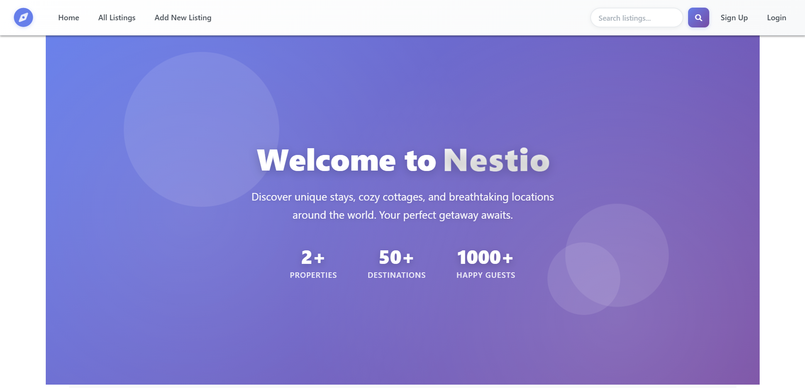

# Nestio

 <!-- Replace with your banner/logo -->

<!-- Badges -->


---

## 📋 Table of Contents

- [About](#about)
- [Features](#features)
- [Tech Stack](#tech-stack)
- [Prerequisites](#prerequisites)
- [Installation](#installation)
- [Environment Variables](#environment-variables)
- [Running the Application](#running-the-application)
- [Project Structure](#project-structure)
- [Screenshots](#screenshots)
- [Deployment](#deployment)
- [Contributing](#contributing)
- [Contact](#contact)
- [Acknowledgments](#acknowledgments)

---

## 🎯 About

Nestio is an Airbnb-like web application where users can:

- Add, update, and delete property listings.
- Browse all listings and view details.
- Add reviews and ratings.
- See listing locations on an interactive map.

Authentication and authorization are implemented using **Passport.js**. Images are uploaded and managed via **Cloudinary**.

---

## ✨ Features

- 🔐 User registration and login (authentication & authorization)
- 📝 CRUD operations for property listings
- 🖼️ Image upload and management via Cloudinary
- ⭐ Review and rating system
- 🔍 Search functionality
- 🗺️ Interactive map for listing locations
- 📱 Responsive UI
- 💻 Full-stack MERN application (without React frontend)

---

## 🛠️ Tech Stack

### Backend
- **Node.js** - Runtime environment
- **Express.js** - Web framework
- **MongoDB** - Database
- **Mongoose** - ODM
- **Passport.js** - Authentication
- **Express Session + connect-mongo** - Session management

### Frontend
- **EJS** - Template engine
- **Bootstrap / Custom CSS** - Styling
- **Leaflet / OpenStreetMap** - Maps integration

### Other Tools
- **Cloudinary** - Image hosting
- **Multer** - File uploads
- **Joi** - Validation
- **dotenv** - Environment variables

---

## 📦 Prerequisites

- Node.js v14+
- npm or yarn
- MongoDB (local or Atlas account)
- Git

---

## 🔧 Installation

1. Clone the repository:

```bash
git clone https://github.com/yourusername/nestio.git
cd nestio


2. Install dependencies:
```bash
npm install
```

🔐 Environment Variables

Create a .env file in the root directory:

PORT=8080
NODE_ENV=development

ATLASDB_URL=your-mongodb-atlas-url
SECRET=your-session-secret

CLOUD_NAME=your-cloudinary-cloud-name
CLOUD_API_KEY=your-cloudinary-api-key
CLOUD_API_SECRET=your-cloudinary-api-secret


▶️ Running the Application
nodemon app.js


The app will run at: http://localhost:8080

📁 Project Structure
nestio/
├── models/              # Mongoose models
│   ├── listing.js
│   ├── review.js
│   └── user.js
├── routes/              # Express routes
│   ├── listing.js
│   ├── review.js
│   └── user.js
├── controllers/         # Route controllers
│   ├── listings.js
│   ├── reviews.js
│   └── users.js
├── middleware/          # Custom middleware
├── utils/               # Utility functions
├── public/              # Static files
├── views/               # EJS templates
├── assets/              # Screenshots / Images
├── .env                 # Environment variables
├── .gitignore
├── app.js
├── package.json
└── README.md

📸 Screenshots
### Home Page


### Listings Page


### Listing Detail


### New Listing Form


### Edit Listing Form


🌐 Deployment

Push project to GitHub.
Set up MongoDB Atlas.
Add environment variables in hosting platform.
Deploy using Render.

🤝 Contributing

Fork the repository
Create a branch (git checkout -b feature/AmazingFeature)
Commit your changes (git commit -m 'Add AmazingFeature')
Push to the branch (git push origin feature/AmazingFeature)
Open a Pull Request


📧 Contact

Ayush Rawat

GitHub: @ayush75847
Email: ayushrawat75847@gmail.com
Project Link: https://github.com/ayush75847/Nestio


🙏 Acknowledgments

MongoDB, Express.js, Node.js, EJS, Cloudinary, Leaflet
Bootstrap / Font Awesome
Tutorials and references that helped in project development
